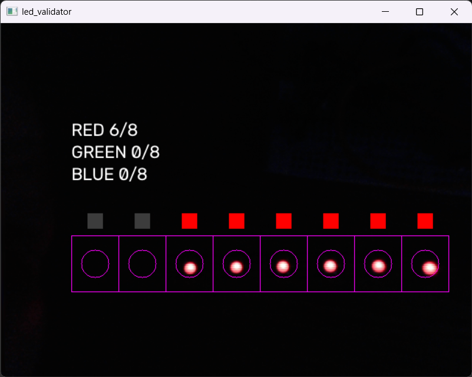
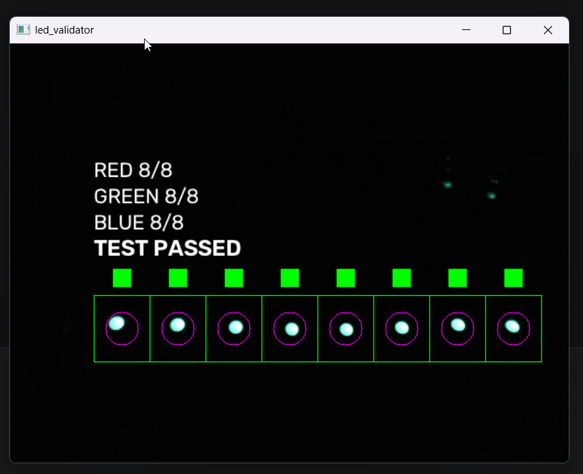
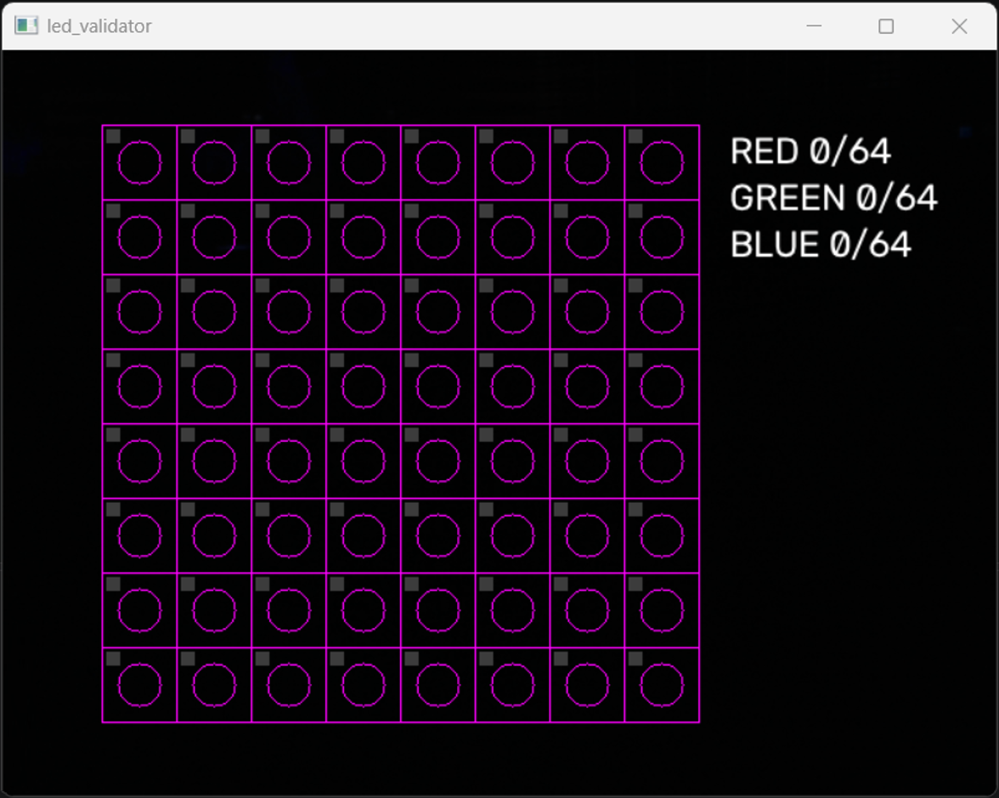
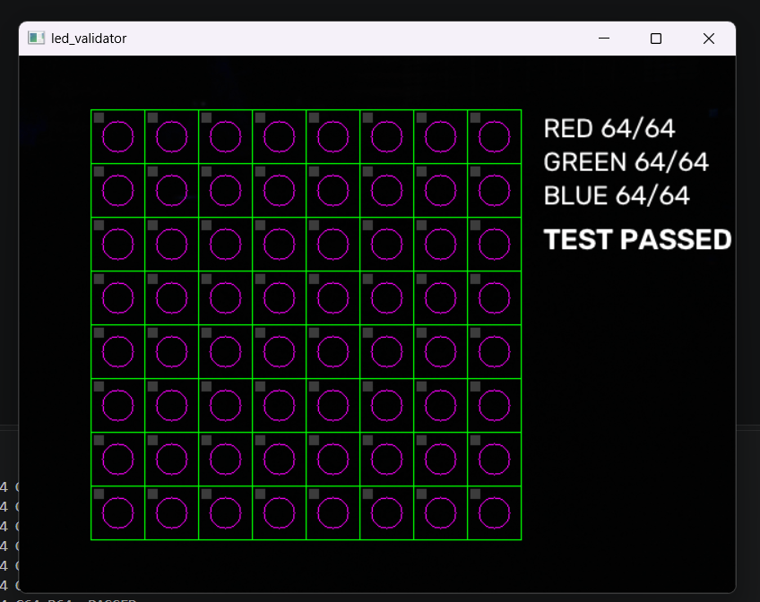

# ws2812-testbench

Bringup Lab, Station 1 – optical and protocol test for WS2812B LED strips and matrices.

## Purpose

WS2812 LEDs have no return channel: the controller sends data and never learns whether a single LED lit up, lit up in the wrong colour, or whether the chain is broken after LED *n*. This bench closes that gap with a webcam that watches the LEDs and judges every one of them by colour, producing a PASS/FAIL verdict with a per-LED report. A second station (planned) taps the data line with a Pico and decodes the bit stream, so cause (protocol) and effect (light) can be compared.

## Status

| Part | State |
|---|---|
| Optical test, 8-LED strip | working |
| Optical test, 8×8 matrix | working |
| DUT firmware (Pico, MicroPython) | manual for now, started from Thonny; serial-triggered sequence planned |
| Protocol observer (second Pico, PIO + DMA) | planned |
| Report files (text + HTML + images) | planned; screenshots only for now |

## Pictures

Strip under test, 8 LEDs, waiting for the sequence. Two LEDs were briefly red when this was taken, hence RED 2/8:



Strip after RED → GREEN → BLUE. Every LED showed all three colours, every cell outline is green:



8×8 matrix, empty bench and after a full run:




*(Fixture photo: camera mount and DUT holder – placeholder, add `docs/fixture.jpg`)*

## How it works

1. The DUT (Raspberry Pi Pico) drives the strip through the sequence: all red, all green, all blue.
2. `optical_validator.py` opens the webcam with exposure and white balance fixed, lays a grid of cells over the LEDs and measures a circle in the middle of each cell.
3. The mean colour inside the circle is converted to HSV. Hue decides the colour; saturation and brightness gate out "dark" and "white".
4. Every LED remembers which colours it has shown. When every LED has shown every colour, the test passes. A cell outline turns green as soon as its LED is complete.
5. On quit (or key `p`) a report lists every incomplete LED with index and missing colours.

Keys while running: `+` / `-` exposure, `r` reset, `p` print report, `q` quit with report.

## Pass criteria

- Every LED shows RED, GREEN and BLUE at some point during the run.
- A colour counts when the measured hue falls into the band for that colour and saturation and brightness are above their thresholds.
- A dark cell (LED off, chain broken) never counts. A cell with the wrong hue never counts for the expected colour.

Hue bands (OpenCV 0–179 scale), measured on this bench with this camera:

| Colour | Hue band | Note |
|---|---|---|
| RED | < 15 or > 165 | wraps around 0 |
| GREEN | 75 – 100 | the green die reads as cyan on this camera |
| BLUE | 105 – 130 | |

Gates: saturation ≥ 60, value ≥ 40.

Re-measure the bands when swapping the camera or the LED type. A different sensor sees different hues.

## Repository layout

```
ws2812-testbench/
├── host/
│   ├── optical/
│   │   ├── led_validator.py          # 8-LED strip
│   │   └── led_matrix_validator.py   # 8x8 matrix
│   └── protocol/                     # planned: decode captured data line
├── firmware/                         # DUT sequence (MicroPython)
├── observer/                         # planned: second Pico, PIO sampler
├── docs/                             # screenshots, fixture photos
├── reports/                          # generated, not versioned
└── README.md
```

## Setup (Windows)

```
py -m venv .venv
.\.venv\Scripts\Activate.ps1
python -m pip install opencv-python
python host\optical\led_validator.py
```

## Known limits

- **Camera settings are driver-dependent.** Exposure is set through DirectShow (`CAP_DSHOW`) with `AUTO_EXPOSURE = 0.25` and a log2 exposure value. Other cameras or backends may ignore these calls; check that `+`/`-` visibly change the image.
- **Geometry is fixed by hand.** The cell grid is placed with fractions of the image size and tuned by eye. Moving the camera or the DUT means re-tuning. There is no automatic LED detection yet.
- **Over-exposure.** A bright LED burns a white core into the image; the colour is read from the halo around it. If the halo is too thin the saturation gate rejects the LED. Lower exposure or LED brightness.
- **Room light.** The bench expects a dark room. Any stray light with a red tint can pass the gates at low levels; the brightness gate is the only defence.
- **Index order.** The matrix validator numbers LEDs row by row from top-left. Whether that matches the firmware's wiring order (serpentine or not) has not been verified yet; an index-coded pattern will settle it.
- **No timing information.** The optical test says *that* an LED lit, not *when* or with what data. That is what the protocol station is for.

## Credits

Code drafted with AI assistance; architecture, fixture and bench verification are mine.
